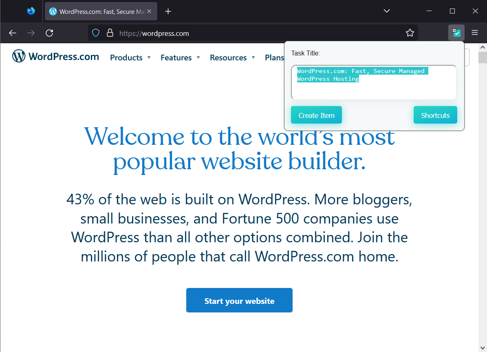
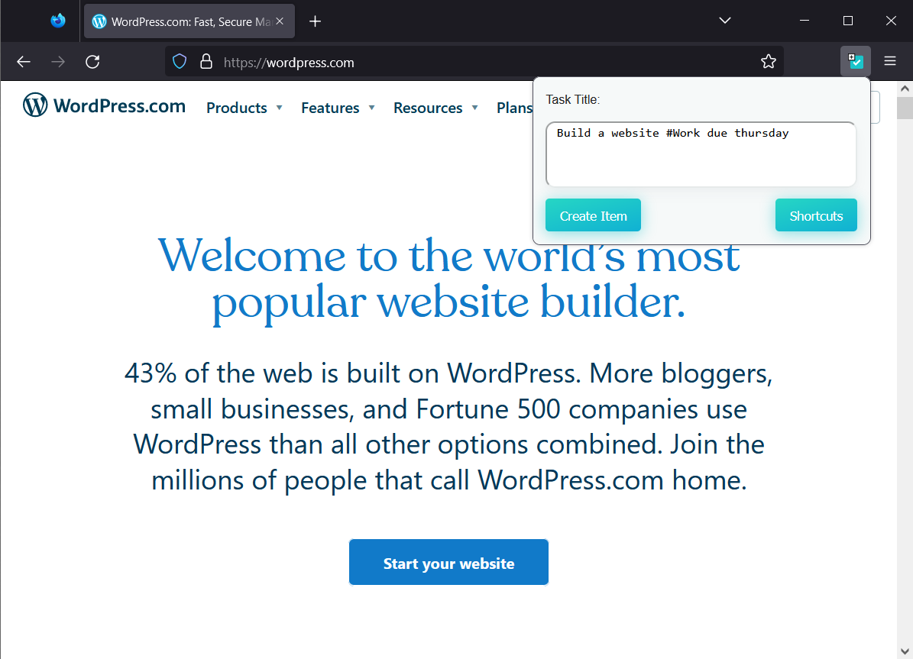
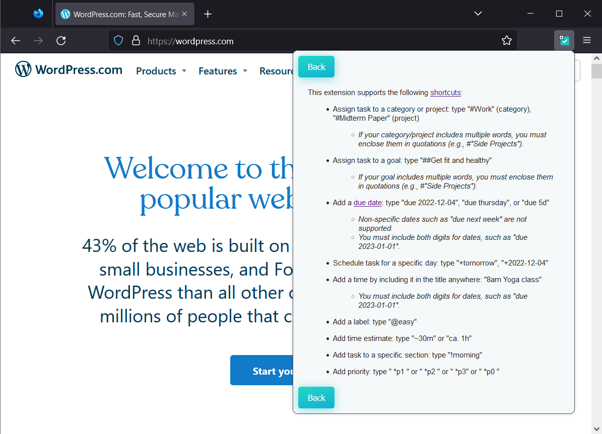

# Save to Marvin Firefox Add-On
A simple Firefox add-on  to save the current web page to the [Amazing Marvin](https://amazingmarvin.com/) productivity service.

NOTE: This project is adapted from Joe Trellick's [Save to Marvin Chrome Extension](https://github.com/joe-trellick/savetomarvin) and is not affiliated with the makers of Amazing Marvin.

# How It Works
### More detailed screenshots of this process for the **Chrome** extension can be found [here](https://github.com/joe-trellick/savetomarvin/blob/main/README.md).
* Visit a web page that corresponds to a task you want to do: perhaps a document to read, the site where you have to pay a bill, or the Gmail message to respond to.

* Click the Save to Marvin button in the Firefox toolbar.

   

* Type the text for your new task. You can use projects like `#Work` and day specifiers like `due thursday`. They will not autocomplete; they will only take effect after the task is saved.

   

* If you find it useful, you can click the **Shortcuts** button to see a list of task input shortcuts compatible with the extension.

   

* Press Enter or click the **Create Item** button. You'll see a loading indicator, and then your new task will be created.

* If you want, you can click **Open Marvin** to go see your new item.

# How To Install

* Find the extension on the [Firefox Add-On page](https://addons.mozilla.org/).
    * The English (US) link is [here](https://addons.mozilla.org/en-US/firefox/addon/save-to-marvin/).
* Install the extension.
* Once installed, you may want to pin the extension to the toolbar.
* You will need to set your Marvin API Key (the extension will prompt you if you try to use it without doing this):
    * Right-click the extension icon, and choose **Manage Extension**. When the Add-ons Manager opens, click **Options**.

    * In another tab or window, navigate to Amazing Marvin, and click the "hamburger" menu in the upper-right corner, and select **Strategies**.

    * In the search box, type `api` to quickly filter to the **API (beta)** strategy. Click the **Settings** button on that one.

    * Click **View Credentials**.

    * Copy the text beside `apiToken:`, then go back to the Save to Marvin extension options window/tab and paste it into the **Amazing Marvin API Key:** text field. Click **Save**, then close that tab.

* You should now be ready to go!

# Support
This was created as a short side project in December 2022 for my own purposes. I am not currently planning to spend any additional time updating this project, but you are more than welcome to use it, adapt it, or use it as the basis for some other project.

## Collaboration

If you would like to be added as a collaborator or owner for this repository, please submit an issue.

If you would like to be added as a collaborator or owner for the current [Save to Marvin product page](https://addons.mozilla.org/en-US/firefox/addon/save-to-marvin/), email me at [Unprepared1313@gmail.com](mailto:unprepared1313@gmail.com). (You may also submit an issue here, but you will need to include the email you want associated with the Firefox add-on.)

## Privacy Policy
You can find the privacy policy for this software [here](PrivacyPolicy.md).
